# Informe de Análisis Exploratorio de Datos (EDA)
## Proyecto: Insight Commerce - Sistema de Recomendación de Próxima Cesta

**Dataset:** Instacart Market Basket Analysis  
**Objetivo:** Identificar patrones de recurrencia y comportamiento de compra para el diseño de un motor de recomendación (*Next-Basket Recommendation*).

---

## Índice de Contenidos
1. [Introducción y Metodología](#1-introducción-y-metodología)
2. [Estructura del Dataset e Integridad de Datos](#2-estructura-del-dataset-e-integridad-de-datos)
3. [Comportamiento del Usuario y Dinámica del Catálogo](#3-comportamiento-del-usuario-y-dinámica-del-catálogo)
4. [Análisis de Reorden y Temporalidad](#4-análisis-de-reorden-y-temporalidad)
5. [Validación del Target y Balance de Clases](#5-validación-del-target-y-balance-de-clases)
6. [Conclusiones y Directrices para el Modelado](#6-conclusiones-y-directrices-para-el-modelado)

---

## 1. Introducción y Metodología
Este informe documenta la exploración y validación de datos necesaria para garantizar la viabilidad del modelo predictivo. El análisis se estructuró en tres fases críticas:

1.  **Diagnóstico de Calidad:** Auditoría técnica para identificar riesgos de integridad y nulos estructurales.
2.  **Exploración Global:** Análisis de patrones de consumo sobre el dataset extendido (millones de registros).
3.  **Validación de Muestra (NeonDB):** Verificación de la integridad del pipeline ETL sobre una muestra controlada de 10,000 usuarios para el entrenamiento final.

---

## 2. Estructura del Dataset e Integridad de Datos

El dataset se organiza mediante una **división temporal**, técnica fundamental para evitar el sesgo de información (*data leakage*).

### 2.1 Segmentación Temporal
* **Prior (`eval_set == 'prior'`)**: Historial transaccional completo. Fuente exclusiva para la ingeniería de características (*Feature Engineering*).
* **Train (`eval_set == 'train'`)**: Última orden registrada. Actúa como el *Ground Truth* (etiquetas) para el aprendizaje supervisado.
* **Test (`eval_set == 'test'`)**: Conjunto reservado para la evaluación final del modelo.

### 2.2 Hallazgos de Calidad
* **Nulos Estructurales:** La variable `days_since_prior_order` presenta un valor nulo por usuario (su primera compra). Se gestionó mediante un flag binario `is_first_order`, transformando el vacío en una señal de comportamiento inicial.
* **Consistencia ETL:** Se validó mediante 8 pruebas de integridad en NeonDB que no existen registros huérfanos ni duplicados, confirmando un aislamiento temporal perfecto entre el historial y el objetivo.

---

## 3. Comportamiento del Usuario y Dinámica del Catálogo

### 3.1 Distribución de Actividad (Efecto Long-Tail)
La frecuencia de compra presenta un marcado sesgo positivo. Mientras la **mediana es de 10 órdenes**, el promedio se eleva a **16.6** debido a un segmento de "Power Users" (hasta 100 órdenes).

> **Implicancia:** Los usuarios con pocas órdenes enfrentan el problema de *Cold Start*, requiriendo estrategias de *fallback* basadas en popularidad global.

> **Decisión de Ingeniería (Filtro de Densidad):** Al analizar la dispersión de datos, observamos que los usuarios con menos de 5 órdenes no presentan patrones de lealtad estables. **Se determinó entrenar el modelo LightGBM exclusivamente con usuarios de $\geq$ 5 órdenes** para reducir el ruido. Para el resto, se aplicará un módulo de **Fallback basado en Popularidad**.

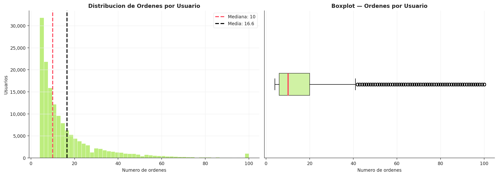

### 3.2 Concentración del Catálogo (Efecto Pareto)
La **Curva de Lorenz** confirma una concentración extrema: el **10% de los productos explica el 81% de las ventas**. 

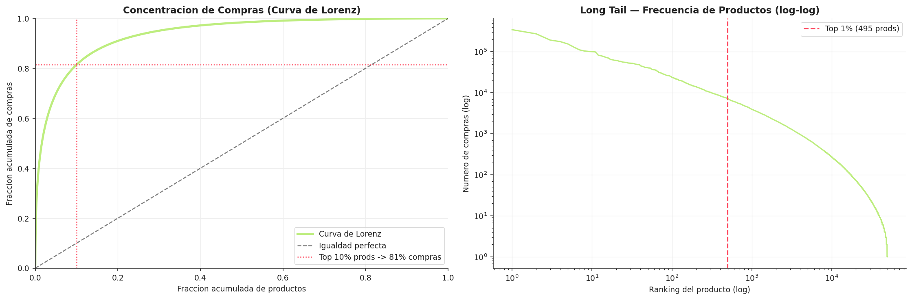

> **Filtro de Producto (Umbral de Rotación):** Para garantizar que las métricas de producto sean estadísticamente significativas, **se incluyeron solo productos con $\geq$ 50 compras totales**. Esto asegura que la tasa de reorden (`p_reorder_rate`) sea un predictor fiable y no una anomalía de pocos registros.

* **Dominio de Frescos:** El Top 20 está liderado por productos perecederos (bananas, lácteos) con ciclos de reposición cortos.

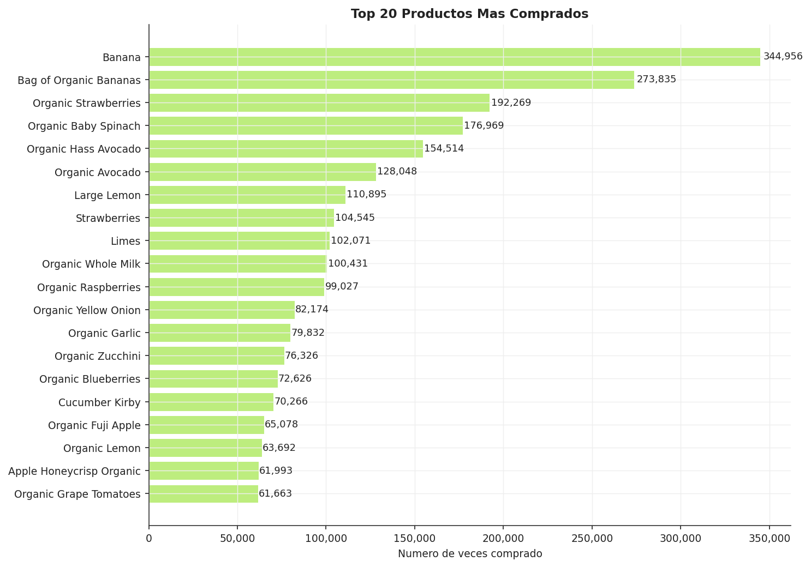

* **Sparsity Diferencial:** Departamentos como *Personal Care* poseen catálogos vastos pero baja rotación, generando una matriz usuario-producto extremadamente dispersa en comparación con *Produce*.

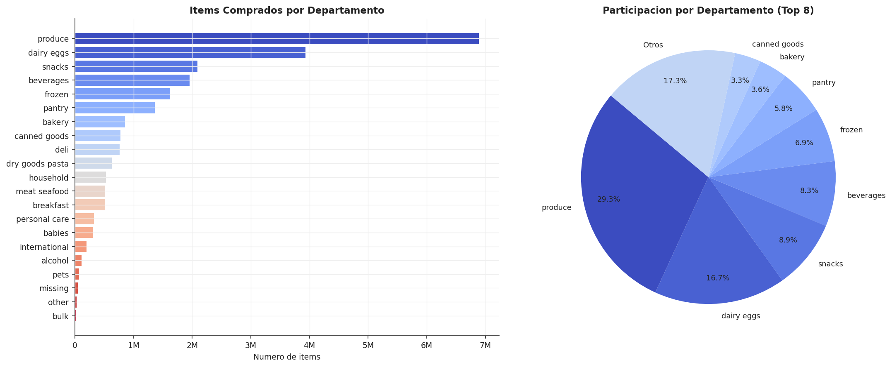

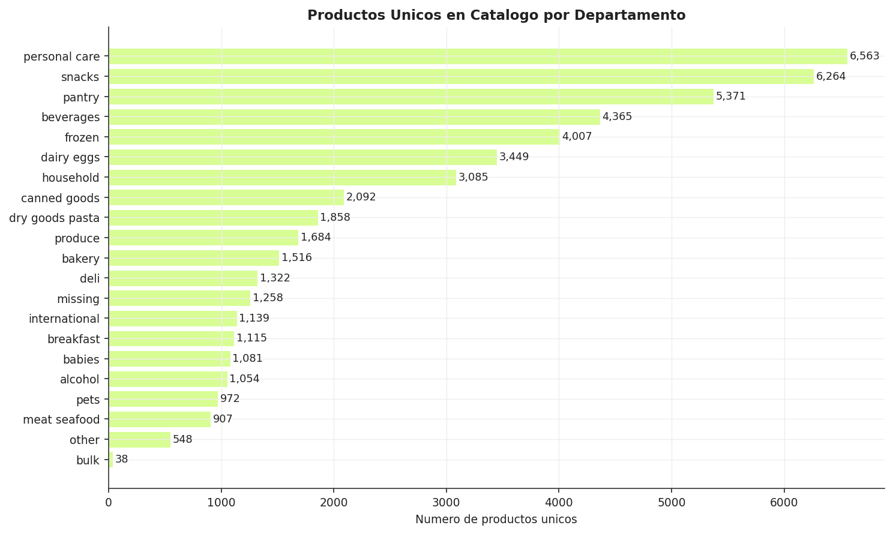

---

## 4. Análisis de Reorden y Temporalidad

### 4.1 La Fuerza del Hábito
* **Tasa Global de Reorden:** **59%**. Esta cifra valida el uso de modelos supervisados, ya que el comportamiento es altamente recurrente.
* **Automatización del Carrito:** Los primeros ítems añadidos a la cesta presentan tasas de reorden **>60%**, reflejando una intención de compra prioritaria.

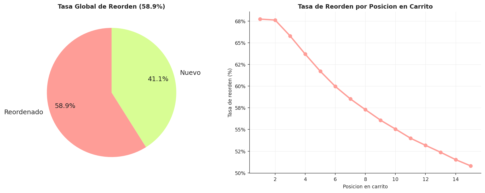

### 4.2 Correlación Popularidad vs. Lealtad
Se detectó una correlación baja entre la popularidad global y la tasa de reorden individual. 
> **Conclusión técnica:** Que un producto sea "superventas" no garantiza su reorden por un usuario específico. Esto justifica técnicamente la inversión en un **modelo personalizado (LightGBM)** frente a un simple sistema basado en "Lo más vendido".

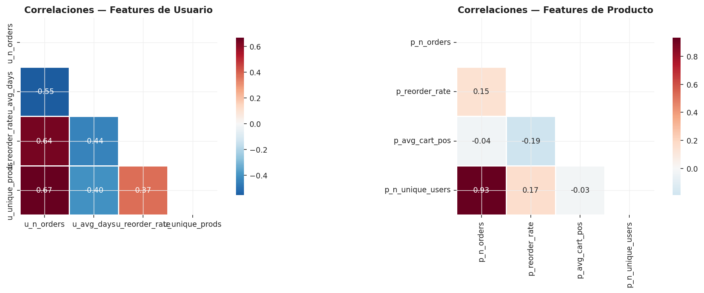

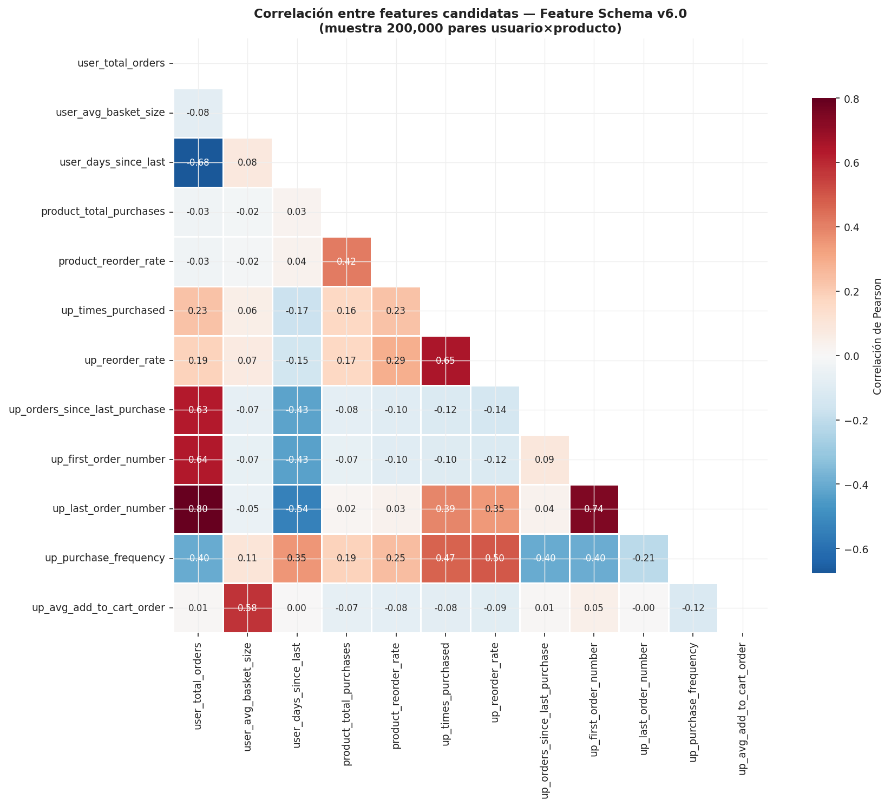

### 4.3 Análisis de Ciclos Temporales y Reposición
El tiempo es un predictor determinante. El comportamiento del usuario no es aleatorio, sino que responde a ciclos de vida de producto y hábitos semanales.

* **Días de Planificación:** Los días **0 (domingo)** y **1 (lunes)** concentran el mayor volumen de pedidos, sugiriendo una conducta de abastecimiento para la semana.
* **Picos Horarios:** La actividad máxima ocurre entre las **10:00 y las 16:00 horas**.

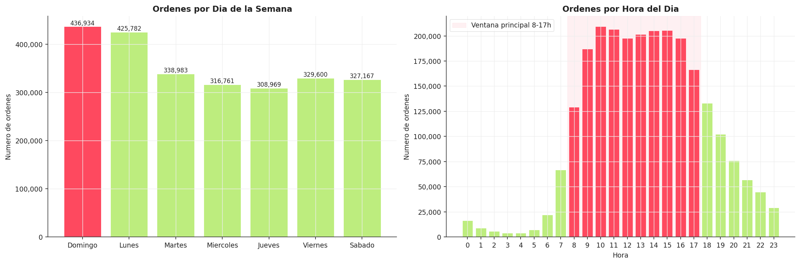

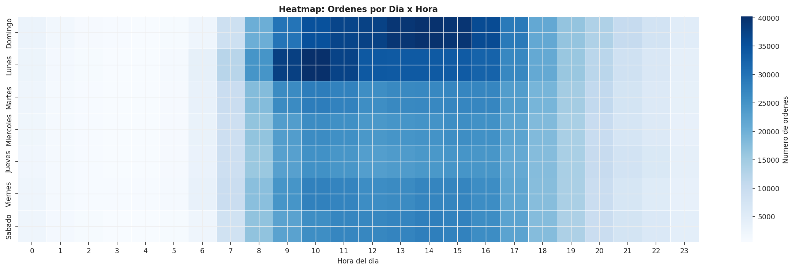

* **Ciclo de Reposición:** La variable `days_since_prior_order` muestra picos bimodales en los **7 y 30 días**, indicando periodos de reposición semanal y mensual respectivamente.

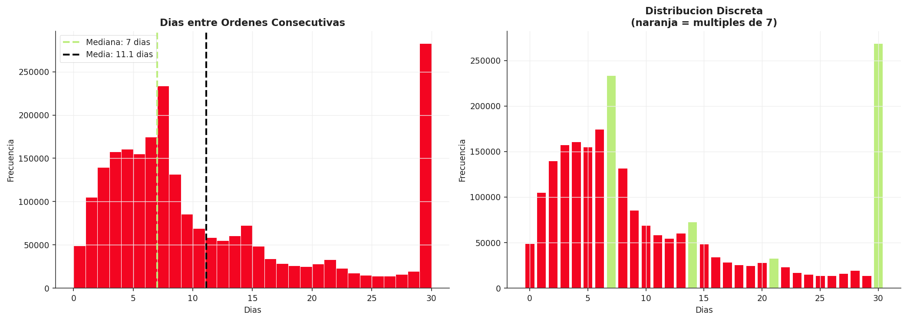

---

## 5. Validación del Target y Balance de Clases

Para el entrenamiento, se transformaron los datos en una matriz de pares **Usuario × Producto**, cruzando el historial con la última orden.

### 5.1 Metodología de Etiquetado
1. **Candidatos:** Pares (u, p) presentes en el historial `prior`.
2. **Label 1:** El par reaparece en la orden `train`.
3. **Label 0:** El par existe en el historial pero fue omitido en la última orden.

### 5.2 Análisis del Desbalance
El proceso reveló un desbalance crítico intrínseco al negocio:
* **Clase Positiva (Label 1):** 9.8%
* **Clase Negativa (Label 0):** 90.2%
* **Ratio de Desbalance:** **9.8 : 1**

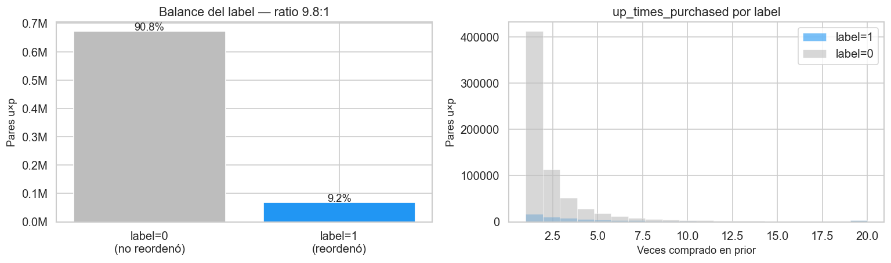

---

## 6. Conclusiones y Directrices para el Modelado

Como resultado directo de este EDA, se definen las siguientes directrices obligatorias para el modelo:

1.  **Segmentación por Calidad de Datos:** El modelo de Machine Learning operará sobre el segmento de alta densidad (Usuarios $\geq$ 5 órdenes / Productos $\geq$ 50 ventas). Esto maximiza la precisión en el "Core" del negocio.
2.  **Compensación de Pesos:** Se configurará **`scale_pos_weight ≈ 9`** en LightGBM para contrarrestar el desbalance y priorizar el *F1* de productos reordenados.
3.  **Features de Interacción:** La baja correlación entre la popularidad global y la lealtad individual confirma que las variables más potentes serán las de interacción (`up_`), las cuales capturan el hábito personal por encima de las modas del catálogo.

**Hito:** Con los umbrales de densidad validados y el target cuantificado, se procede a la **Ingeniería de Características**.

---